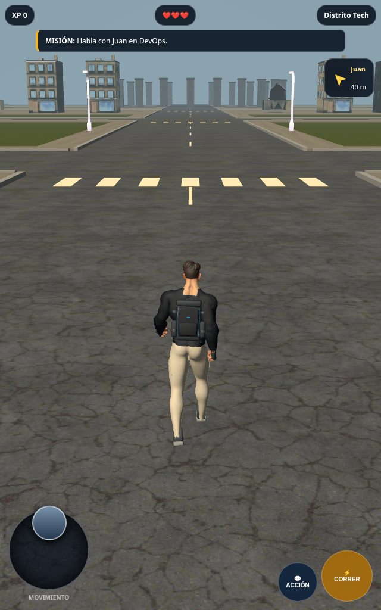
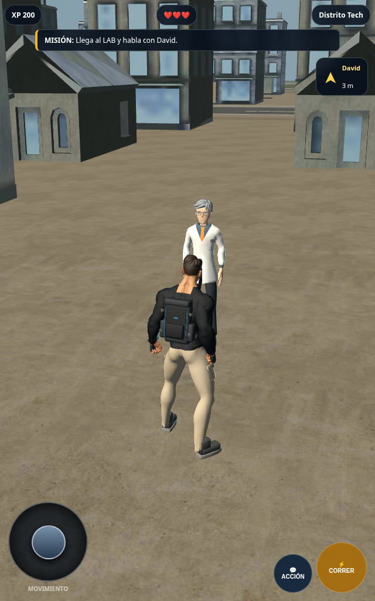

# Fase 5 — piloto de personajes aprobados

Fecha: 9 de octubre de 2026. **Estado: parcial; cuatro humanos integrados y
verificados en Chromium. Vanguard y la validación Samsung siguen pendientes.**

El usuario aprobó Juan, Sara y David condicionado a corregir la espalda baja
de la bata. Se verificó la corrección en seis poses reales de Chromium y se
registró la aprobación en `assets/characters/npc-phase4/approval.json`. Su
instrucción de continuar autoriza este piloto con los humanos aprobados.

## Alcance y acceso

Rama: `stage11-approved-character-pilot`. Sobre esta copia de desarrollo,
abrir `/?pilot=1&characters=approved` para cargar Alejandro explorador, Juan,
Sara y David en la ciudad existente: cuatro distritos y 83 edificios.
La dirección pública sigue utilizando el commit aprobado `3e0ec79`.

Los cuatro GLB aprobados se utilizan sin reexportarlos ni modificar sus
fuentes Blender. Sus treinta entregables registrados conservan tamaño y
SHA-256. Los créditos y licencias CC0 permanecen junto a los recursos.

Warden conserva el robot del piloto anterior únicamente para verificar las
mecánicas actuales. **Ese robot no es el Vanguard elegido ni un reemplazo
aprobado.** La fase de cinco personajes se completará cuando se obtengan el
archivo oficial del Vanguard, sus texturas y su licencia, se adapte su rig y
se apruebe visualmente.

## Integración y contacto con el suelo

El catálogo de humanos se selecciona mediante el parámetro explícito. Se
conservan el adaptador visual de 180 grados y el contrato de animaciones
existente. Los NPC permanecen en `Idle`; los recursos también ofrecen
`Interact` y `Wave`, sin introducir nuevas reglas de interacción.

La ciudad tiene superficies a distintas alturas: calzada a 5–6 cm, andén a
16 cm, anteplazas a 5,5 cm y arena a 14 cm. Un adaptador exclusivo del piloto
ajusta la altura de la malla y su sombra de contacto según 187 superficies
estáticas existentes. La raíz del personaje y los cuerpos de Rapier no
cambian de altura. Se conservan los clips y sus 3–4 mm de separación de suela.

El ajuste se ejecuta antes de renderizar, después del movimiento. No altera
controles, cámara, velocidades, misiones, diálogos, combate, reinicio,
colisionadores ni distribución urbana. Usa límites de superficies planas y
alineadas; no implementa IK de pies, pendientes ni escalones físicos. Los
adornos elevados de la arena quedan excluidos del cálculo de suelo.

## Validación realizada

- Regresión: **ocho grupos de archivos, cero fallos**, 643,6 ms.
- Suite completa de Chromium: **seis pruebas, cero fallos**, 1,4 minutos.
  El test del nuevo piloto tardó 6,4 s; no reemplaza las cinco pruebas previas.
- Se verifican carga de los cuatro GLB, rigs, reposo estacionario de NPC,
  caminar/correr, orientación según cámara, siete superficies, colisiones,
  misiones y diálogos de Juan/Sara/David, combate, victoria, reinicio y
  restauración de callbacks al destruir el runtime.
- Capturas adicionales con controles y HUD reales: joystick, tres acciones
  de misión, etapa 3 y XP 300; cero errores de página registrados.
- Los cuatro GLB suman 6.938.532 bytes. Es el tamaño de los archivos, no una
  medición de descarga, memoria GPU o rendimiento en Samsung.

Las pruebas locales usaron `/usr/bin/chromium` y PlayCanvas 2.23.0. La
configuración de CI y el workflow no se modificaron. Sus logs están en
`evidence/approved-pilot/`; `verification-report.json` registra los hashes
verificados y las limitaciones.

## Evidencia visual

Las vistas de Juan, Sara y reposo de Alejandro se conservan en la misma
carpeta. Las seis vistas de la espalda de David están en `evidence/david-back/`.
Son capturas de los modelos reales en PlayCanvas, sin retoque.

Para reproducir las capturas en este entorno, iniciar un servidor de esta
rama en `127.0.0.1:4173` y ejecutar `node tools/check-approved-character-pilot.mjs`.
`tools/check-approved-david-back.mjs` reproduce las seis poses de la bata sin
modificar los recursos. Los scripts de captura usan Chromium instalado en
`/usr/bin/chromium`; la suite de CI usa el Chromium de Playwright.

## Pendientes de cierre

1. Obtener el ZIP oficial del Vanguard seleccionado, texturas y licencia;
   comprobar coste gráfico, rig y clips, adaptar y aprobar Warden.
2. Completar el piloto de cinco personajes y sus comprobaciones de ciudad,
   colisiones, materiales y rendimiento.
3. Validar esta integración en Samsung y registrar su aprobación.
4. Promover únicamente con CI satisfactorio y autorización del usuario.

La prueba Samsung de `3e0ec79` conserva su validez como referencia; todavía
no acredita este piloto nuevo. No se ha publicado esta rama en main.
